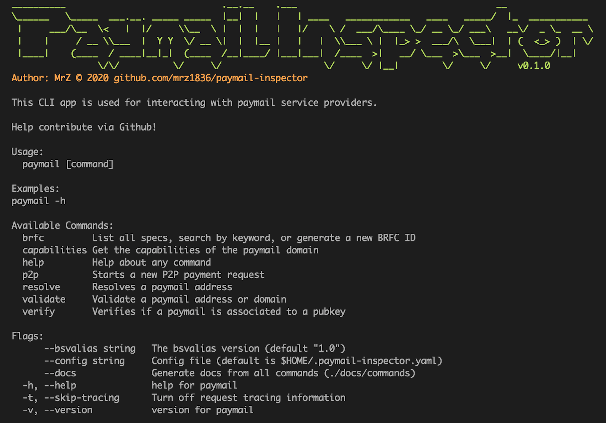

# Paymail Inspector

[](https://golang.org/)
[](https://travis-ci.com/mrz1836/paymail-inspector)
[](https://goreportcard.com/report/github.com/mrz1836/paymail-inspector)
[](https://github.com/mrz1836/paymail-inspector/releases)
[](https://github.com/RichardLitt/standard-readme)
[](https://pkg.go.dev/github.com/mrz1836/paymail-inspector?tab=subdirectories)

> **paymail-inspector** is a CLI tool for inspecting, validating or resolving paymail addresses and domains


## Table of Contents
- [Installation](#installation)
- [Documentation](#documentation)
- [Examples & Tests](#examples--tests)
- [Benchmarks](#benchmarks)
- [Code Standards](#code-standards)
- [Usage](#usage)
- [Maintainers](#maintainers)
- [Contributing](#contributing)
- [License](#license)

## Installation

**Run via [brew](https://github.com/mrz1836/homebrew-paymail-inspector)**
```bash
$ brew tap mrz1836/paymail-inspector && brew install paymail-inspector
$ paymail-inspector -h
```

**Run via [Go](https://formulae.brew.sh/formula/go)**
```bash
$ go get -u github.com/mrz1836/paymail-inspector && go install github.com/mrz1836/paymail-inspector
$ paymail-inspector -h
```

**Run via [compiled binary](https://github.com/mrz1836/paymail-inspector/releases)** on Linux, Mac or Windows _(Mac example)_
```bash
$ curl -LkSs https://github.com/mrz1836/paymail-inspector/releases/download/v0.0.20/paymail-inspector_macOS_64-bit.tar.gz -o app.tar.gz
$ tar -zxf app.tar.gz
$ ./app/paymail-inspector -h
```

## Commands

### `brfc`
> List all known brfc specifications ([view example](docs/examples.md#list-brfc-specifications))
```bash
$ paymail-inspector brfc list
```

> Generate a new `BRFC ID` for a new specification ([view example](docs/examples.md#generate-new-brfc-id))
```bash
$ paymail-inspector brfc generate --title "BRFC Specifications" --author "andy (nChain)" --version 1
```

> Search all brfc specifications (id, title, author) ([view example](docs/examples.md#search-brfc-specifications))
```bash
$ paymail-inspector brfc search nChain
```

___

### `capabilities`
> Lists the available capabilities of the paymail service ([view example](docs/examples.md#get-capabilities-by-domain))
```bash
$ paymail-inspector capabilities moneybutton.com
```

___

### `p2p`
> Starts a P2P payment request and returns (n) outputs of (`script`,`satoshis`,`address`) ([view example](docs/examples.md#start-p2p-payment-request-by-paymail))
```bash
$ paymail-inspector p2p mrz@moneybutton.com
```

___

### `resolve`
> Returns the `pubkey`, `output script` and `address` for a given paymail address ([view example](docs/examples.md#resolve-paymail-address-by-paymail))
```bash
$ paymail-inspector resolve mrz@moneybutton.com
```

___


### `validate`
> Runs several validations on the paymail service for DNSSEC, SSL, SRV and required capabilities ([view example](docs/examples.md#validate-paymail-setup-by-paymail-or-domain))
```bash
$ paymail-inspector validate moneybutton.com
```

___


### `verify`
> Verifies if a paymail is associated to a pubkey ([view example](docs/examples.md#verify-public-key-owner))
```bash
$ paymail-inspector verify mrz@moneybutton.com 02ead23149a1e33df17325ec7a7ba9e0b20c674c57c630f527d69b866aa9b65b10
```

## Documentation
Get started with the [examples](docs/examples.md). View the generated golang [godocs](https://pkg.go.dev/github.com/mrz1836/paymail-inspector?tab=subdirectories).

All the generated command documentation can be found in [docs/commands](docs/commands).

This application was built using the [official paymail specifications](http://bsvalias.org/index.html).

Additional paymail information can also be found via [MoneyButton's documentation](https://docs.moneybutton.com/docs/paymail-overview.html).

### Implemented [BRFCs](http://bsvalias.org/01-brfc-specifications.html)
- [x] BRFC ID Assignment ([assignment](http://bsvalias.org/01-02-brfc-id-assignment.html))
- [x] Service Discovery ([b2aa66e26b43](http://bsvalias.org/02-service-discovery.html))
- [x] Public Key Infrastructure (pki) ([0c4339ef99c2](http://bsvalias.org/03-public-key-infrastructure.html))
- [x] Basic Address Resolution ([759684b1a19a](http://bsvalias.org/04-01-basic-address-resolution.html))
- [x] Verify Public Key Owner ([a9f510c16bde](http://bsvalias.org/05-verify-public-key-owner.html))
- [x] PayTo Protocol Prefix ([7bd25e5a1fc6](http://bsvalias.org/04-04-payto-protocol-prefix.html))
- [x] Public Profile [(f12f968c92d6)](https://github.com/bitcoin-sv-specs/brfc-paymail/pull/7/files)
- [x] P2P Payment Destination ([2a40af698840](https://docs.moneybutton.com/docs/paymail-07-p2p-payment-destination.html))
- [x] Sender Validation ([6745385c3fc0](http://bsvalias.org/04-02-sender-validation.html))
- [ ] P2P Transactions ([5f1323cddf31](https://docs.moneybutton.com/docs/paymail-06-p2p-transactions.html))
- [ ] Receiver Approvals ([3d7c2ca83a46](http://bsvalias.org/04-03-receiver-approvals.html))
- [ ] Merchant API ([ce852c4c2cd1](https://github.com/bitcoin-sv-specs/brfc-merchantapi))
- [ ] JSON Envelope Specification ([298e080a4598](https://github.com/bitcoin-sv-specs/brfc-misc/tree/master/jsonenvelope))
- [ ] Fee Specification ([fb567267440a](https://github.com/bitcoin-sv-specs/brfc-misc/tree/master/feespec))
- [ ] MinerID ([07f0786cdab6](https://github.com/bitcoin-sv-specs/brfc-minerid))
- [ ] MinerID Extension: FeeSpec ([62b21572ca46](https://github.com/bitcoin-sv-specs/brfc-minerid/tree/master/extensions/feespec))
- [ ] MinerID Extension: MinerParams ([1b1d980b5b72](https://github.com/bitcoin-sv-specs/brfc-minerid/tree/master/extensions/minerparams))
- [ ] MinerID Extension: BlockInfo ([a224052ad433](https://github.com/bitcoin-sv-specs/brfc-minerid/tree/master/extensions/blockinfo))
- [ ] MinerID Extension: BlockBind ([b8930c2bbf5d](https://github.com/bitcoin-sv-specs/brfc-minerid/tree/master/extensions/blockbind))

<details>
<summary><strong><code>Custom Configuration</code></strong></summary>

The configuration file should be located in your `$HOME` folder and named `.paymail-inspector.yaml`.

View the [example config file](.paymail-inspector.yaml).
</details>

<details>
<summary><strong><code>Package Dependencies</code></strong></summary>

- bitcoinsv's [bsvd](https://github.com/bitcoinsv/bsvd) and [bsvutil](https://github.com/bitcoinsv/bsvutil) for BSV script functionality
- go-resty's [resty](https://github.com/go-resty/resty) for custom HTTP client support
- miekg's [dns](https://github.com/miekg/dns) package for advanced DNS functionality
- mitchellh's [go-homedir](https://github.com/mitchellh/go-homedir) to find the home directory
- MrZ's [go-validate](https://github.com/mrz1836/go-validate) for domain/email/ip validations
- ryanuber's [columnize](https://github.com/ryanuber/columnize) for displaying terminal data in columns
- spf13's [cobra](https://github.com/spf13/cobra) and [viper](https://github.com/spf13/viper) for easy configuration & CLI application development
- ttacon's [chalk](https://github.com/ttacon/chalk) for colorful logs
</details>

<details>
<summary><strong><code>Application Deployment</code></strong></summary>

[goreleaser](https://github.com/goreleaser/goreleaser) for easy binary deployment to Github and can be installed via: `brew install goreleaser`.

The [.goreleaser.yml](.goreleaser.yml) file is used to configure [goreleaser](https://github.com/goreleaser/goreleaser).

Use `make release-snap` to create a snapshot version of the release, and finally `make release` to ship to production.

The release can also be deployed to a `homebrew` repository: [homebrew-paymail-inspector](https://github.com/mrz1836/homebrew-paymail-inspector).
</details>

<details>
<summary><strong><code>Makefile Commands</code></strong></summary>

View all `makefile` commands
```bash
$ make help
```

List of all current commands:
```text
all                            Runs test, install, clean, docs
bench                          Run all benchmarks in the Go application
build-go                       Build the Go application (locally)
build                          Build all binaries (darwin, linux, windows)
clean                          Remove previous builds and any test cache data
clean-mods                     Remove all the Go mod cache
coverage                       Shows the test coverage
darwin                         Build for Darwin (macOS amd64)
gen-docs                       Generate documentation from all available commands (fresh install)
godocs                         Sync the latest tag with GoDocs
help                           Show all make commands available
install                        Install the application
lint                           Run the Go lint application
linux                          Build for Linux (amd64)
release                        Full production release (creates release in Github)
release-test                   Full production test release (everything except deploy)
release-snap                   Test the full release (build binaries)
run                            Runs the go application
tag                            Generate a new tag and push (IE: make tag version=0.0.0)
tag-remove                     Remove a tag if found (IE: make tag-remove version=0.0.0)
tag-update                     Update an existing tag to current commit (IE: make tag-update version=0.0.0)
test                           Runs vet, lint and ALL tests
test-short                     Runs vet, lint and tests (excludes integration tests)
uninstall                      Uninstall the application (and remove files)
update                         Update all project dependencies
update-releaser                Update the goreleaser application
vet                            Run the Go vet application
windows                        Build for Windows (amd64)
```
</details>


## Examples & Tests
All unit tests and [examples](docs/examples.md) run via [Travis CI](https://travis-ci.com/mrz1836/paymail-inspector) and uses [Go version 1.14.x](https://golang.org/doc/go1.14). View the [deployment configuration file](.travis.yml).

Run all tests (including integration tests)
```bash
$ make test
```

## Code Standards
Read more about this Go project's [code standards](CODE_STANDARDS.md).

## Usage
View all the [examples](docs/examples.md) and see the [commands above](#commands)

All the generated command documentation can be found in [docs/commands](docs/commands).

## Maintainers

| [](https://github.com/mrz1836) | [](https://github.com/rohenaz) |
|:---:|:---:|
| [MrZ](https://github.com/mrz1836) | [Satchmo](https://github.com/rohenaz) |


## Contributing

Inspiration and code snippets from [dnssec](https://github.com/binaryfigments/dnssec) and [check-ssl](https://github.com/wycore/check-ssl)

Utilized [terminalizer](https://terminalizer.com/) to record example gifs

View the [contributing guidelines](CONTRIBUTING.md) and follow the [code of conduct](CODE_OF_CONDUCT.md).

Support the development of this project 🙏

[](https://mrz1818.com/?tab=tips&af=paymail-inspector)

## License

